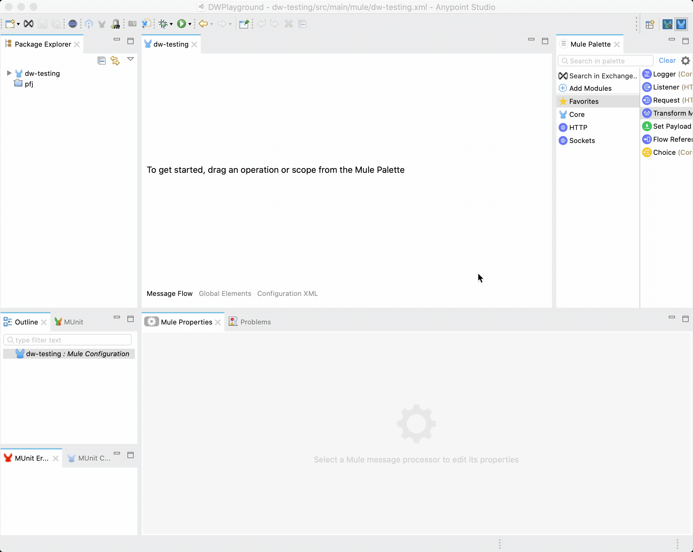

## Table of Contents

1. [Environment setup](#environment-setup)
   1. [Anypoint Studio](#anypoint-studio)
   2. [Data-weave playground](#data-weave-playground)
2. [Syntax Basics](#syntax-basics)
   1. [What the heck is the `---`?](#what-the-heck-is-the----)
   2. [Anonymous functions, lambdas, and their syntax sugar - `$`, `$$`..](#anonymouslambda-functions-and-their-syntax-sugar----)
   3. [`{( ... )}` .. what magic is this?!?](#-----what-magic-is-this)
3. [Must know functions](#must-know-functions)
   1. [`map`](#map)
   2. [`mapObject`](#mapobject)
   3. [`match`](#match)
   4. [Putting them together for a recursive pattern](#putting-them-together-for-a-recursive-pattern)
   4. [`filter`](#filter)
   5. [`orderBy`](#orderby)
   6. [`flatten` and `flatMap`](#flatten-and-flatmap)
   7. [`pluck`](#pluck)
   8. [`reduce`](#reduce)
   9. [`++` and `--` (yup, they're functions!)](#-and---)

---

# Environment Setup

### **Anypoint Studio**

Your go to IDE should always be Anypoint Studio - this is the only **official** way to work with Mule (outside of design center at least). No other environment is going to give you access to all of the features of data-weave, and no other environment is going to guarntee that your data-weave behaves as expected when moved into production.

The two most common arguments against studio that I hear are that it is either too slow / resource intensive, or that the experience isn't as good as the web based playground. To that end, I've laid out what I think are some 'best practices' for using studio.

**Use a separate workspace or project**. If you're looking for a place to quickly work on data-weave, and you find studio to be too slow / non-responsive, consider using a separate workspace just for your data-weave. When you have a multiple projects in studio, the background tooling is constantly running to validate / resolve metadata. The less you have open, the faster it's going to run! So if you're working on a complicated data-weave for a project, separating it out into a separate project and closing your main project can be beneficial. This also sets you up for creating reusable data-weave modulues if thats the route you decide to go!

Think the three panel experience the playground gives you is better? Guess what, studio can do it too! Just throw a transform message component in your project, double click the component properties tab, and turn on preview!

<a href="#" onclick="enlargeImage(this)"></a>

There you go! Full screen code editing, your sample payload on the left (if you haven't set it yet, it will prompt you for a data type first), and all functionality of data-weave is supported, such as importing modules, custom flat file formats, every single output writer, etc.

### **Data-weave playground**

**_The playground is NOT an official tool and is not supported by Mulesoft. The playground is a hobby project written by someone with a passion for data-weave, but you shouldn't be using it for anything other than quick snippets_**

<a href="#" onclick="enlargeImage(this)"></a>

So I just got done telling you to do all of your data-weave development in studio, and now I'm talking about the web-based playground. What gives? Well, one good reason to use the playground is for testing in specific snapshots of data-weave; I personally keep the latest DW2.X version and the latest DW1.X version. I typically find myself going to the playground when writing up a snippet for someone on stackoverflow or to answer a question on slack - you just can't beat how quick it is to bring up and play with. What I'm not doing is writing data-weave intended for a project; I can't setup proper folder structures, unit testing, logging, etc. It only makes sense to me for quick, short snippets.

The playground is a docker image; if you don't know what docker is or how to use it, [start here](https://docker-curriculum.com/).

You can find the list of data-weave playground tags [here](https://hub.docker.com/r/machaval/dw-playground/tags).

#### To quickly launch the 2.3.1 playground for one-time usage:

`docker run --publish 9999:8080 machaval/dw-playground:2.3.1-SNAPSHOT`

And now you can access the playground at http://localhost:9999

#### To launch 2.3.1 as a named, detached playground which will start with your system:

`docker run --detach --publish 8080:9999 --name dw-playground-2.3.1 --restart unless-stopped machaval/dw-playground:2.3.1-SNAPSHOT`

Pick whichever snapshot you want to use from the tag list and get going with it. I'm not going to go any further into the playground as it is pretty straightforward - and pretty limited. If you run into issues with the playground, I suggest moving your wokr to the studio as the playground is not supported.

---

# Syntax Basics

### **What the heck is the ---?**

```data-weave{4,7}
%dw 2.0
output application/json
var numbers = 1 to 30
---
numbers map do {
  var prevNumber = numbers[$$-1]
  ---
  $ + prevNumber
}
```

So what exactly does the `---` we see above mean? For a scoped expression, it represents the separation of the head and body. The body of an expression **_must_** yield a value. That makes it rather difficult to do things like setting a variable... which is where the head comes in. If you need to set a variable, define a function, etc, you get it done in the head. The `do { }` creates a new scope in which we can put another head/body, allowing us to set variables and make use of them in the body of expressions. Here is a real world example (with all the messy bits removed) showing why this is useful:

```data-weave{7,11}
%dw 2.0
output application/json

var doCalc(item, previousItem) ->
  //add some logic here where we do a loyalty adjustment using the previous item
  item
---
//our payload is a set of loyalty items
payload orderBy $.transactionDate map do {
  var calc = doCalc(item, payload[max([0, $$-1])])
  ---
  ($ - "customAttributes") ++ "customAttributes": ({
    "adjustedQualifyingFills": calc.adjustedQualifyingFills,
    "adjustedEarnLevel": calc.adjustedEarnLevel
  })
}
```

As you can see, we are now able to create a scope in our main body, with its own head/body, allowing us to call a function, get a result, and then make use of that in our `map`. Neat.

### **Anonymous/lambda functions, and their syntax sugar - `$`, `$$`..**

In data-weave examples, you probably see things like this _a lot_ right?

```data-weave
%dw 2.0
output application/json

var items = 1 to 10
---
items map ($$): $
```

Which results in:

```JSON
[
 { "0": 1 }, { "1": 2 }, { "2": 3 }, { "3": 4 }, { "4": 5 },
 { "5": 6 }, { "6": 7 }, { "7": 8 }, { "8": 9 }, { "9": 10 }
]
```

Yeah.. ok.. but where exactly did the `$` and `$$` come from, and what do they mean?

First, lets talk about infix notation vs prefix notation. We know that `map` is a function which takes parameters `Array<T>` and `Function`. You can just take a look at the documentation [here](https://docs.mulesoft.com/mule-runtime/4.3/dw-core-functions-map#map1) to see that. If you're coming from another language, you'd probaby expect to call it like this:

```data-weave
%dw 2.0
output application/json

var items = 1 to 10
var myMapFunction = (item, index) ->
  (index): item
---
map(items, myMapFunction)
```

Well, this is valid in data-weave!

This is known as prefix notation - our function followed by our inputs. If you've been doing software development for a while, prefix notation makes sense - its how we do things! For most people though, infix notation, which looks like `X + Y`, where our function/operator is between our inputs, makes a lot more sense. We say `X plus Y`, not `plus X, Y`. With dataweave, we can use infix notation for any function that takes exactly two parameters. Take [`orderBy`](https://docs.mulesoft.com/mule-runtime/4.3/dw-core-functions-orderby#orderby2) - it requires an `Array` and a `Function` as input; exactly two. This also allows us to chain our functions:

```data-weave
payload orderBy $.transactionId map $.message
```

What we're saying here is `payload ordered by transactionId, and then mapped to an array of the object's messages`. With function chaining, we take the result of each function and use it as the first parameter of the next function. There are some precedence rules you should keep in mind, which you can find [here](https://docs.mulesoft.com/mule-runtime/4.3/dataweave-flow-control-precedence); if you're getting an error about incorrect types with function chaining, 9/10 times you're facing a presedence issue and wrapping with `( ... )` can fix it.

Ok - so we've covered infix notation which explains a good bit about whats going on.. that still doesn't tell us what `$` and `$$` stand for though! These are what are known as [syntax sugar](https://en.wikipedia.org/wiki/Syntactic_sugar). They exist to make our code more concise and easier to understand (at least once you understand what they're doing) by allowing us to only define the body of our anonymous functions. Lets take our example before, where we had

```data-weave
var myMapFunction = (item, index) ->
  (index): item
```

Instead of defining this function in the header, we could actually do it inline as an anonymous function:

```data-weave
payload orderBy $.transactionId map ((item, index) ->
  (index): item
)
```

Why not make it a little more concise? We find ourselves making anonymous functions so often, it would be really nice to just supply the body of the function, rather than the entire lambda. Well, data-weave allows us to do this.. and says, assign `$` for the first paramter, `$$` for the second, `$$$` for the third.. noticing the pattern here? The `$` provides anonymous access to the parameters, where the number of `$` symbols represents the position of the paramter.. since `map` takes a function with `(item, index)` as its parameters, `$` becomes our item and `$$` becomes our index.

What about nested functions? Well, how can you tell the `$` from the outer function and the `$` from the inner function apart? You can't, which means you won't be able to reference the outer function's parameters. When working with nested functions, even if you don't need the outer function's parameters, I would recommend using a lambda with named parameters to keep things clear. Code that is easier to understand trumps code that is more concise - it all compiles the same!

### `{( ... )}` - What magic is this?!

If you're familiar with javascript, you should be familiar with object deconstruction as it's become an extremely common pattern. Well, data-weave can do it too!

Here is our first example, deconstructing one object in order to build a new one:

```data-weave
%dw 2.0
output application/json

var items = [{ id: 1, message: "Hello world!" }, { id: 2, message: "Goodbye world!" }]
---
items map {
  ($),
  destination: "dest1"
}
```

And we get the output

```JSON
[{
    "id": 1,
    "message": "Hello world!",
    "destination": "dest1"
  },
  {
    "id": 2,
    "message": "Goodbye world!",
    "destination": "dest1"
}]
```

As you can see, we've deconstructed the key-value pairs of the object, allowing us to preserve the original object in our new object. To better illustrate what this is doing, let's change it up a bit.

```data-weave
%dw 2.0
output application/json

var items = [{ id: 1, message: "Hello world!" }, { id: 2, message: "Goodbye world!" }]
---
{(items)}
```

And as output we get

```JSON
{
  "id": 1,
  "message": "Hello world!",
  "id": 2,
  "message": "Goodbye world!"
}
```

As you can see, we can deconstruct arrays too - we've deconstructed our array of objects into a single object of key value pairs. The gist is that when `( .. )` is contained within `{ .. }`, the contents get deconstructed. Combined with the ability to remove specific keys from an object, this makes it very easy (well, as easy as it got pre [`update`](https://docs.mulesoft.com/mule-runtime/4.3/dw-values-functions-update)) to update a key by removing it and then reconstructing it with the new value.

---

# Must Know Functions

### [map](https://docs.mulesoft.com/mule-runtime/4.3/dw-core-functions-map)

Easily the most used function in data-weave, the `map` function iterates through our array, calling a function passing in the item and index, and returning the results as an array.

```data-weave
%dw 2.0
output application/json

var items = 10 to 100
---
items map {
  index: $$,
  value: $
}
```

Results in

```JSON
[
  {
    "index": 0,
    "value": 10
  },
  {
    "index": 1,
    "value": 11
  },
  {
    "index": 2,
    "value": 12
  },
  ...
```

Map is iterating every item, and we're mapping it into a new item with the keys `index` and `value`. Remember though! Data is immutable in data-weave, so we aren't iterating the array in place, so we have to yield a new item which is included in our resulting array.

### [mapObject](https://docs.mulesoft.com/mule-runtime/4.3/dw-core-functions-mapobject)

`mapObject` allows us to iterate all of the `key:value` pairs of an object. `$$` is our key, `$` is our value, and `$$$` is our `key:value` index. `mapObject` takes in an object and should yield an object.

A real world use case might be doing something like taking the result of a scatter-gather, and flattening it into a single object of `key:value` pairs. We can easily do this by doing a `mapObject` and deconstructing our payloads. (Of course, if you go learn your selectors, you could also accomplish this more succinctly).

Input:
```JSON
{
  "0": {
    "payload": {
        "firstName": "Mike",
        "lastName": "Jones"
    }
  },
  "1": {
      "payload": {
          "Line1": "555 Main Street",
          "Line2": null,
          "City": "Atlanta",
          "State": "GA"
      }
  }
}
```

Data-weave:
```data-weave
%dw 2.0
output application/json
---
payload mapObject {( $.payload )}
```

Transforms to:
```JSON
{
  "firstName": "Mike",
  "lastName": "Jones",
  "Line1": "555 Main Street",
  "Line2": null,
  "City": "Atlanta",
  "State": "GA"
}
```

### [match](https://docs.mulesoft.com/mule-runtime/4.3/dw-core-functions-match)

### Putting them together for a recursive pattern..

Now that we know `mapObject`, `map`, and `match`, we can put them together for a basic recursive pattern that allows us to touch the entire structure of our object.

```data-weave
%dw 2.0

var diveObject = (p: Any) ->
  p match {
    case p is Array -> p map diveObject($),
    case p is Object -> p mapObject ($$): diveObject($),
    else -> $
  }
```
To break this down, we're creating a function and saying (1) when `p` is an `Array`, iterate through each element of the array and call `diveObject` on it, (2) when `p` is an `Object`, iterate through each `key:value` pair, reconstructing it with the original `key` and then calling `diveObject` on the value, and (3) when it isn't an `Object` or `Array`, just yield `p`. As this runs through recursively, if the value of a `key:value` pair is another `Object` or `Array`, it will now start traversing it, so on and so forth, until it has iterated the entire structure.

This is a fairly common pattern you'll see in data-weave.

Let's consider a use case where we want to find ALL values of Cat, reguardless of where in the object it is, and change it to Dog.. pretty easy with this pattern!

```data-weave
%dw 2.0

var imADogPerson = (p: Any) ->
  p match {
    case is Array -> p map imADogPerson($)
    case is Object -> p mapObject ($$): imADogPerson($)
    else -> if (lower($) == "cat") "dog" else $
  }

output application/json
---
imADogPerson(
  {
    "allowedSpecies": [
      "fish",
      "dog",
      "cat"
    ],
    "myPet": "cat",
    "petsInMyBuilding": [
      {
        "name": "bob",
        "species": "fish"
      },
      {
        "name": "lyla",
        "species": "cat"
      },
      {
        "name": "roxy",
        "species": "dog"
      }
    ]
  }
)
```

Which results in:

```JSON
{
  "allowedSpecies": [
    "fish",
    "dog",
    "dog"
  ],
  "myPet": "dog",
  "petsInMyBuilding": [
    {
      "name": "bob",
      "species": "fish"
    },
    {
      "name": "lyla",
      "species": "dog"
    },
    {
      "name": "roxy",
      "species": "dog"
    }
  ]
}
```

Ok ok.. I promise I like cats too!! As you can see though, this is a powerful pattern in which we can manipulate the entire structure of an object quickly, and easily. One of my CookBook examples shows you how to append an XML namespace one very object key as simply as

```data-weave
payload appendNamespace tem
```

For more complicated usages, where you only want to update a specific key at a specific level, we have the new update function which you can find in the docs.

### [filter](https://docs.mulesoft.com/mule-runtime/4.3/dw-core-functions-filter)

### [orderBy](https://docs.mulesoft.com/mule-runtime/4.3/dw-core-functions-orderby)

### [flatten](https://docs.mulesoft.com/mule-runtime/4.3/dw-core-functions-flatten) & [flatMap](https://docs.mulesoft.com/mule-runtime/4.3/dw-core-functions-flatmap)

### [pluck](https://docs.mulesoft.com/mule-runtime/4.3/dw-core-functions-pluck)

### [reduce](https://docs.mulesoft.com/mule-runtime/4.3/dw-core-functions-pluck)

### [++](https://docs.mulesoft.com/mule-runtime/4.3/dw-core-functions-plusplus) and [--](https://docs.mulesoft.com/mule-runtime/4.3/dw-core-functions-minusminus)